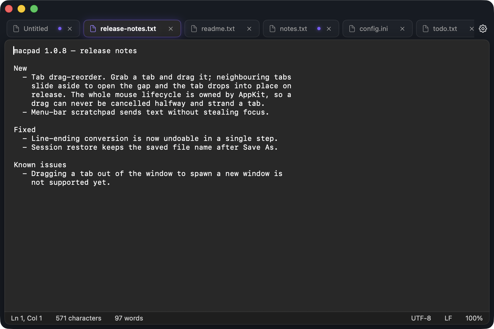
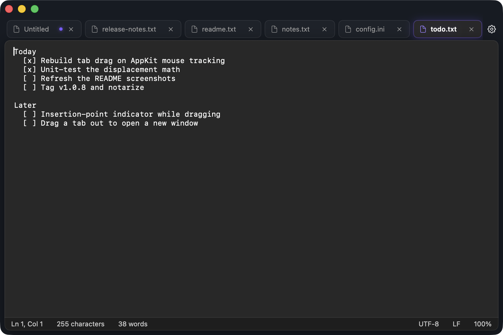
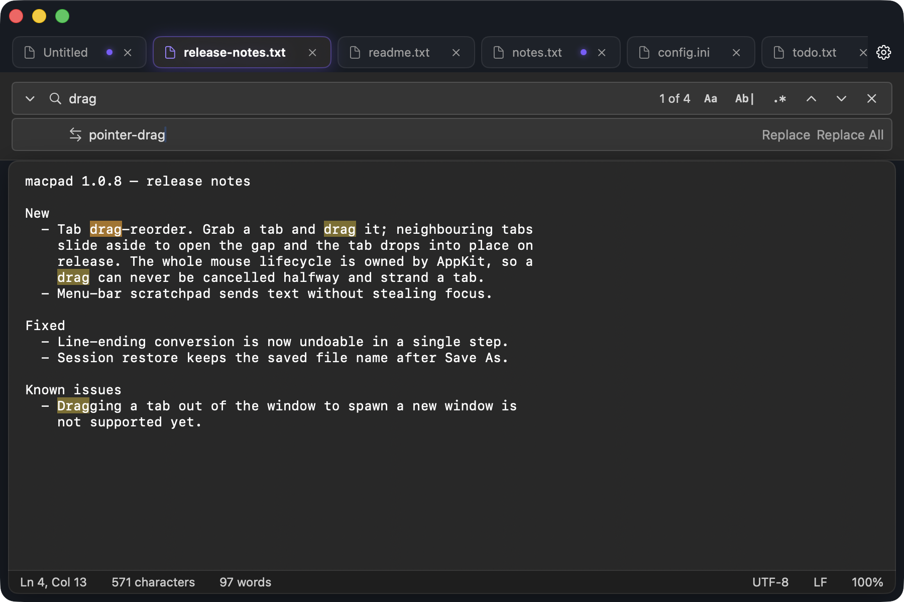
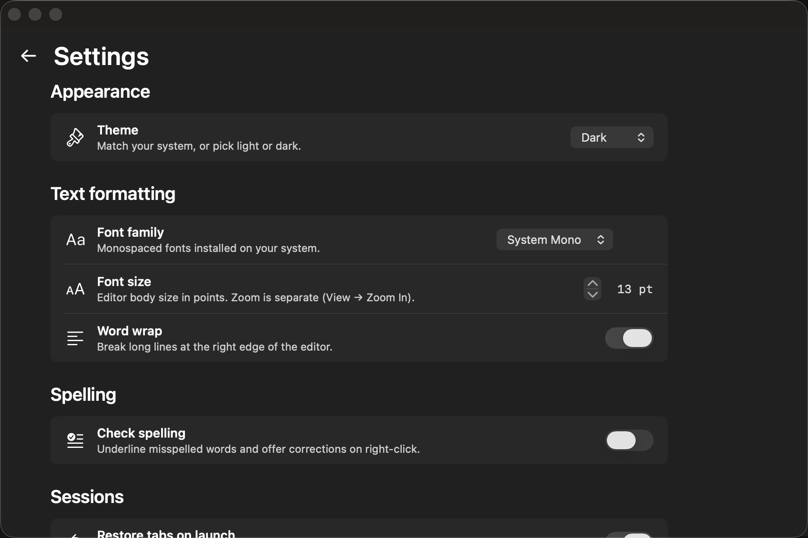

# macpad

A native macOS text editor inspired by the Windows 11 Notepad.

<p align="center"></p>

> **Disclaimer:** macpad is an independent, unofficial fan project. It is **not affiliated with, endorsed by, or sponsored by Microsoft Corporation**. "Windows," "Windows 11," and "Notepad" are trademarks of Microsoft Corporation. macpad ships none of Microsoft's proprietary code, fonts, or assets — only open-source components from third parties (see [Credits](#credits)).

<a href="https://www.buymeacoffee.com/thefinder808" target="_blank"></a>

## Features

- **Multi-tab editing** with a Win11-style tab strip and per-tab undo history
- **TextKit 1** `NSTextView` core — smart quotes, dash substitution, autocorrect, link detection, and data detection all disabled by default (matches Win11 Notepad's "what you type is what you get" behavior)
- **Optional spellcheck** — off by default; toggle on in Settings (no autocorrect — only red underlines + right-click suggestions)
- **Find / Replace** overlay with regex, match-case, and whole-word toggles
- **BOM-aware file open** — UTF-8 (with or without BOM), UTF-16 LE/BE, Windows-1252
- **Line-ending conversion** — LF, CRLF, CR (undoable)
- **Per-tab zoom**, configurable font family and size, word wrap toggle
- **Always on Top** — keep the window floating above other apps for quick copy/paste (View menu or Settings)
- **Select line from the left margin** — click the left margin beside a line to select the whole line; drag to select several (toggle in Settings)
- **Live status bar** — line/column, character count, word count, encoding, EOL, zoom
- **Autosave** — every keystroke (debounced 750 ms) writes to `~/Library/Application Support/macpad/Sessions/`
- **Session restore** — quit with tabs open, relaunch with the same tabs, cursor positions, and scroll offsets
- **Dark / Light / System** themes (Win11 color tokens verified against the open-source `microsoft-ui-xaml` repo)
- **Finder integration** — Open With, drag-and-drop a file onto the window to open as a new tab
- **Send to macpad** — select text in any app, then right-click → Services → "Send to macpad (New Tab)" / "(Current Tab)" to stash it in macpad without leaving the app you're in (enable once in System Settings → Keyboard → Keyboard Shortcuts → Services)
- **Tab drag-reorder**
- **Custom app icon** designed for macpad — paper stack on a blue gradient (not Microsoft's Notepad icon)
- **Notarized .dmg distribution** via `./build.sh notarize`

## Keyboard shortcuts

| Action | Shortcut |
|---|---|
| New tab | ⌘T |
| Open file | ⌘O |
| Save | ⌘S |
| Save As | ⇧⌘S |
| Close tab | ⌘W |
| Next tab | ⌘⇧] |
| Previous tab | ⌘⇧[ |
| Find | ⌘F |
| Find next | ⌘G |
| Find previous | ⇧⌘G |
| Replace | ⌘H |
| Toggle word wrap | ⌥⌘W |
| Zoom in | ⌘= |
| Zoom out | ⌘- |
| Reset zoom | ⌘0 |
| Settings | (click the gear icon at the top-right of the tab strip) |

Standard macOS text-editing shortcuts (⌘Z undo, ⇧⌘Z redo, ⌘A select all, ⌘X/⌘C/⌘V cut/copy/paste) all work via the responder chain.

## Screenshots

<p align="center"></p>

<p align="center"></p>

<p align="center"></p>

## Install

Download the latest signed and notarized `.dmg` from [Releases](https://github.com/thefinder808/macpad/releases), drag `macpad.app` to `/Applications`, and launch.

The DMG is signed with a Developer ID and notarized by Apple, so Gatekeeper will accept it without any "untrusted developer" prompts.

## Build from source

Requires Xcode command-line tools (Swift 5.9+) and macOS 14 (Sonoma) or later.

```bash
git clone https://github.com/thefinder808/macpad.git
cd macpad
./build.sh run         # debug build, exec binary with stdout visible
./build.sh open        # debug build, launch as a normal app
./build.sh release     # release .app, ad-hoc signed
./build.sh install     # release .app copied to /Applications
./build.sh clean       # remove build artifacts
```

For notarized distribution (requires a Developer ID cert and `xcrun notarytool` keychain profile):

```bash
brew install create-dmg
xcrun notarytool store-credentials macpad-notary \
    --apple-id <email> --team-id <TEAMID> --password <app-specific>
./build.sh notarize    # produces dist/macpad-<version>.dmg
```

## Architecture

- **Swift Package Manager**, single executable target — no `.xcodeproj`.
- **SwiftUI** for layout and state; **AppKit interop** (`NSViewRepresentable`) for the editor (`NSTextView`), window chrome, and the `NSVisualEffectView` backdrop.
- **`@main` App** + `NSApplicationDelegateAdaptor` + a shared `AppState` (`static let shared`) so the AppDelegate can reach the same instance SwiftUI uses for autosave flush on termination.
- **One shared `NSTextView`** with `textStorage` and `undoManager` swapped on tab activation — O(1) views, O(N) storages, matches Sublime / VS Code.
- **Reference-type `TabState`** because `NSTextStorage` and `NSUndoManager` have identity.
- **TextKit 1**, not TextKit 2 — macOS 14.x TextKit 2 has open regressions on temporary-attribute drawing (used for find highlights) and IME composition.
- **Spellcheck yes, autocorrect no** — macOS NSTextView has no per-view override for sentence-start capitalization or period substitution, so enabling `isAutomaticSpellingCorrectionEnabled` would silently drag along the system-wide auto-capitalization (mangling `teh` → `Teh`). Spellcheck is wired to a per-tab `isContinuousSpellCheckingEnabled` toggle; autocorrect is hard-`false`.

## Support

If macpad makes your Mac-life slightly nicer and you'd like to say thanks:

<a href="https://www.buymeacoffee.com/thefinder808" target="_blank"></a>

Or just star the repo — that's also great.

## Credits

macpad would not have been possible without these open-source components:

- **[Fluent UI System Icons](https://github.com/microsoft/fluentui-system-icons)** — MIT-licensed icon set by Microsoft, used for tabs, status bar, and settings.
- **[Cascadia Mono](https://github.com/microsoft/cascadia-code)** — OFL-licensed monospace font by Microsoft (optional editor font).
- **[`microsoft-ui-xaml`](https://github.com/microsoft/microsoft-ui-xaml)** — MIT-licensed Win11 design token reference (`Common_themeresources_any.xaml`, `TabView_themeresources.xaml`).

All three of these are explicitly open-sourced by Microsoft under permissive licenses. No proprietary Microsoft code, fonts, or assets are bundled with macpad.

The app icon was designed with [Claude Design](https://claude.com/design).

The macOS-side architecture borrows conventions established in two of my earlier macOS apps, [MacPerf](https://github.com/thefinder808/macperf) and [TraceView](https://github.com/thefinder808/traceview) — `build.sh` notarize pipeline, `AppTheme` protocol, the `isMenuTracking` gate against menu-tracking flicker, and the SwiftPM-only project layout.

## License

[MIT](LICENSE) © 2026 Nathaniel Graham
